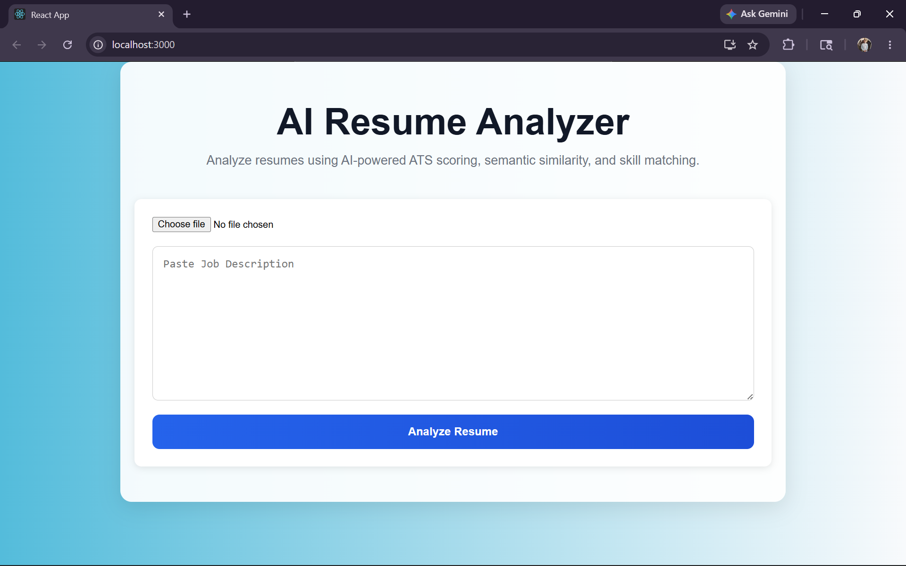
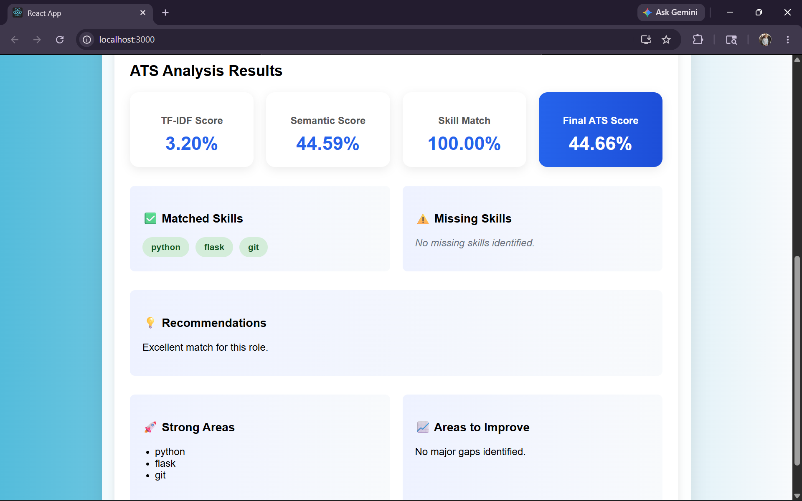

# AI Resume Analyzer

An AI-powered Full-Stack ATS (Applicant Tracking System) Resume Analyzer built using React, FastAPI, NLP, and Transformer-based Semantic Similarity.

The system analyzes resumes against job descriptions by:
- extracting text from PDF resumes,
- preprocessing text using NLP techniques,
- calculating ATS similarity scores,
- performing semantic similarity analysis using transformers,
- extracting technical skills,
- identifying missing skills and skill gaps,
- generating AI-powered ATS insights and recommendations.

---

# Features

## Resume Text Extraction
- Extracts text from PDF resumes using `pdfplumber`
- Supports multi-page resumes
- Performs basic text cleanup

## NLP Preprocessing
- Lowercasing
- Tokenization
- Stop word removal
- Lemmatization
- Text normalization

## ATS Similarity Scoring
- TF-IDF vectorization
- Cosine similarity calculation
- ATS match percentage generation

## Semantic Similarity
- Transformer-based semantic analysis
- Sentence embeddings using `SentenceTransformers`
- Meaning-aware resume matching
- Contextual similarity scoring

## Skill Extraction
- Rule-based technical skill extraction
- Predefined skill database
- Resume skill identification

## Hybrid ATS Scoring
Final ATS score is calculated using:
- TF-IDF similarity
- Semantic similarity
- Skill match percentage

## Missing Skill Detection
- Detects matched skills
- Identifies missing job-required skills
- Generates ATS recommendations

## Frontend Dashboard
- Resume upload interface
- Job description input
- ATS score visualization
- Dashboard-style UI
- Skill tag visualization
- Recommendation section

## FastAPI Backend
- REST API architecture
- File upload handling
- Swagger API documentation
- Frontend-backend integration

---

# Screenshots

## Homepage



## ATS Analysis Dashboard



---

# Project Architecture

```text
React Frontend
       ↓
Axios API Requests
       ↓
FastAPI Backend
       ↓
Resume Text Extraction
       ↓
NLP Preprocessing
       ↓
Skill Extraction
       ↓
TF-IDF Similarity
       ↓
Semantic Similarity
       ↓
Hybrid ATS Scoring
       ↓
ATS Insights & Recommendations
```

---

# Hybrid ATS Scoring Logic

Final ATS Score combines:

- TF-IDF Similarity Score
- Semantic Similarity Score
- Skill Match Percentage

```text
Final ATS Score =
40% TF-IDF Similarity
+ 30% Semantic Similarity
+ 30% Skill Match Score
```

---

# Project Structure

```text
AI-resume-analyzer/
│
├── backend/
│   │
│   ├── api/
│   │   └── app.py
│   │
│   ├── parser/
│   │   └── extract_text.py
│   │
│   ├── preprocessing/
│   │   ├── preprocess.py
│   │   └── setup_nltk.py
│   │
│   ├── similarity/
│   │   ├── similarity.py
│   │   └── semantic_similarity.py
│   │
│   ├── skills/
│   │   ├── skills.py
│   │   └── extract_skills.py
│   │
│   ├── insights/
│   │   └── skill_gap.py
│   │
│   ├── uploads/
│   │
│   └── main.py
│
├── frontend/
│   │
│   ├── src/
│   │   ├── App.js
│   │   └── App.css
│
├── screenshots/
│
├── requirements.txt
├── .gitignore
└── README.md
```

---

# Technologies Used

## Frontend
- React
- Axios
- CSS

## Backend
- Python
- FastAPI
- Uvicorn

## NLP & AI
- NLTK
- scikit-learn
- Sentence Transformers
- HuggingFace Transformers

## Resume Processing
- pdfplumber

## Similarity Techniques
- TF-IDF
- Cosine Similarity
- Transformer Embeddings

---

# Installation

## Clone Repository

```bash
git clone https://github.com/YOUR_USERNAME/AI-resume-analyzer.git
```

---

## Navigate into Project

```bash
cd AI-resume-analyzer
```

---

# Backend Setup

## Create Virtual Environment

### Windows

```bash
python -m venv venv
```

---

## Activate Virtual Environment

### Windows

```bash
venv\Scripts\activate
```

---

## Install Backend Dependencies

```bash
pip install -r requirements.txt
```

---

# Download NLTK Resources

Run:

```bash
python backend/preprocessing/setup_nltk.py
```

---

# Run FastAPI Backend

```bash
uvicorn backend.api.app:app --reload
```

Backend runs at:

```text
http://127.0.0.1:8000
```

---

# Frontend Setup

## Navigate to Frontend

```bash
cd frontend
```

---

## Install Frontend Dependencies

```bash
npm install
```

---

## Run React Frontend

```bash
npm start
```

Frontend runs at:

```text
http://localhost:3000
```

---

# API Documentation

Swagger Docs:

```text
http://127.0.0.1:8000/docs
```

---

# Current Capabilities

- Resume PDF parsing
- NLP preprocessing pipeline
- TF-IDF similarity scoring
- Transformer-based semantic similarity
- Hybrid ATS scoring system
- Skill extraction
- Missing skill detection
- AI-powered ATS recommendations
- Full-stack React + FastAPI integration
- Dashboard-based UI visualization

---

# Future Improvements

- LLM-powered resume feedback
- Resume improvement suggestions using GenAI
- Job recommendation system
- Authentication system
- Resume history tracking
- Database integration
- Docker deployment
- Cloud deployment
- Multi-resume comparison

---

# Learning Outcomes

This project helped in understanding:
- NLP preprocessing
- TF-IDF vectorization
- Cosine similarity
- Semantic embeddings
- Transformer models
- Skill extraction systems
- Hybrid AI scoring systems
- FastAPI backend development
- React frontend integration
- REST APIs
- Full-stack AI application architecture